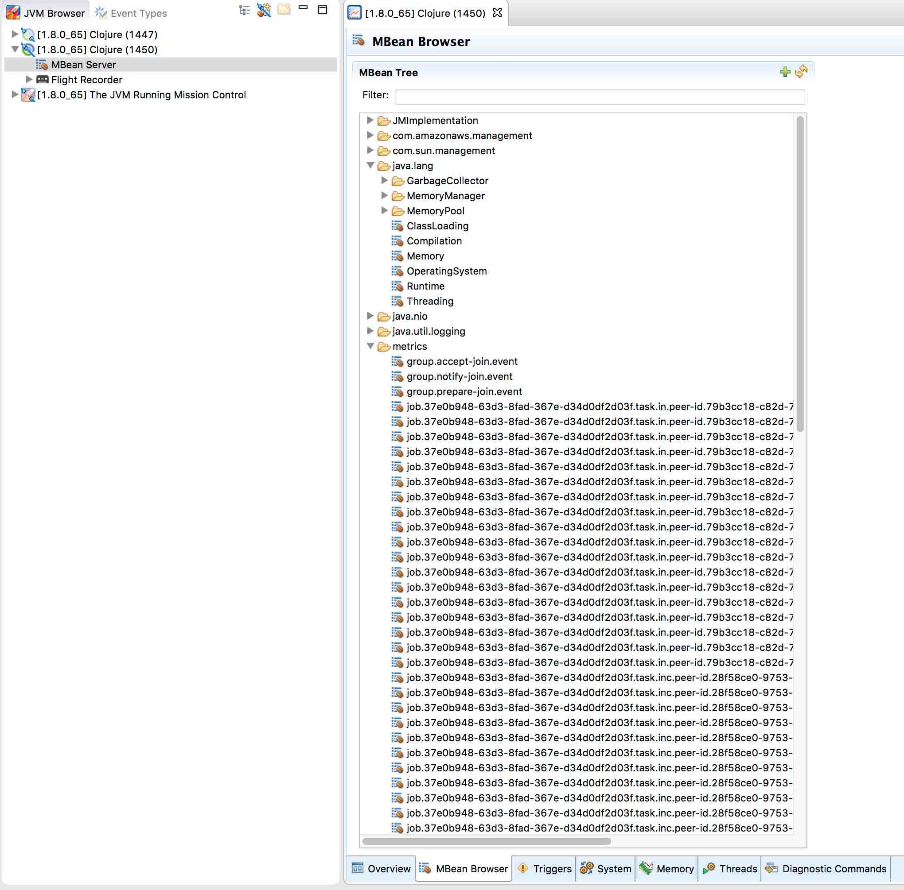

# onyx-metrics

Onyx Metrics has been pulled in to onyx core. Onyx core reports all metrics to
JMX. Please use a JMX exporter / agent for your metrics system, or use
[prometheus](https://prometheus.io/) with
[onyx-peer-http-query](https://github.com/onyx-platform/onyx-peer-http-query)'s
metric endpoint.

This repository will include configurations for dropwizard metrics [reporters](http://metrics.dropwizard.io/3.1.0/getting-started/#other-reporting) in the future.

When developing locally, the quickest way to access metrics is to:

1. run `jmc` (Java Mission Control) from your command line (Oracle Java JDK 1.8+ required).
2. Select the correct running JVM in the left bar.
3. Double click MBean Server.
4. Expand "metrics" view.
5. Select metrics.

You can also connect to running remote instances, after configuring remote JMX.

